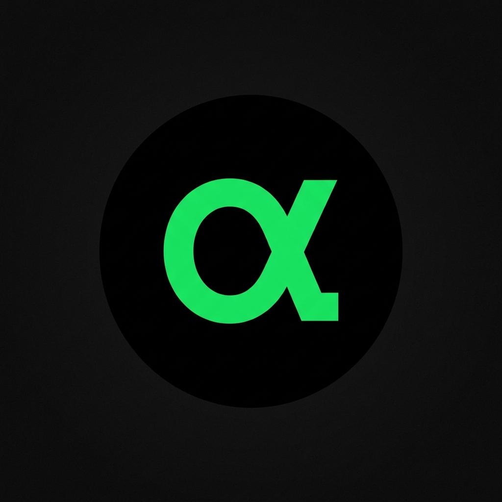

# AlphaLens 🚀

AlphaLens is a premium, AI-powered trading companion designed to provide retail traders with institutional-grade insights. Built with a focus on high-fidelity UI/UX and advanced data analysis, AlphaLens bridges the gap between raw market data and actionable intelligence.



##  Features

- **Crystal Clear Market Visuals**: Integration with TradingView for advanced charting, technical analysis gauges, and baseline comparisons.
- **AI-Powered Sentiment**: Real-time news sentiment analysis using the DistilRoBERTa model to gauge market pulse and consensus.
- **AlphaLens AI Insights**: Deep assessment cards providing AI-driven summaries, bull/bear cases, and technical outlooks for any ticker.
- **Anomaly Detection**: Sophisticated tracking of unusual price and volume activity to alert users of potential market manipulation or breakouts.
- **Shadow Portfolio Agent**: A reinforcement learning-based allocation simulator that tracks model performance against "Buy & Hold" strategies.
- **Watchlist Management**: Secure, real-time watchlist tracking with cloud-sync via Clerk authentication.
- **Premium Glassmorphic Design**: A state-of-the-art "Modern Dark" aesthetic with glassmorphism, high-contrast neon accents, and smooth animations.

##  Tech Stack

- **Framework**: [Next.js 15+](https://nextjs.org/) (App Router)
- **Styling**: [Tailwind CSS 4.0](https://tailwindcss.com/)
- **Authentication**: [Clerk](https://clerk.com/)
- **Database**: [MongoDB](https://www.mongodb.com/) with [Mongoose](https://mongoosejs.com/)
- **Icons**: [Lucide React](https://lucide.dev/)
- **Charts/Widgets**: [TradingView Embeds](https://www.tradingview.com/widget/)
- **Market Data**: [Finnhub API](https://finnhub.io/)
- **Background Jobs**: [Inngest](https://www.inngest.com/)

##  Getting Started

### Prerequisites

- Node.js 20+
- A MongoDB instance
- Clerk API keys
- Finnhub API key

### Installation

1. Clone the repository:
   ```bash
   git clone https://github.com/your-repo/alphalens.git
   cd alphalens
   ```

2. Install dependencies:
   ```bash
   npm install
   ```

3. Configure environment variables:
   Create a `.env.local` file in the root directory and add your keys:
   ```env
   NEXT_PUBLIC_CLERK_PUBLISHABLE_KEY=...
   CLERK_SECRET_KEY=...
   MONGODB_URI=...
   NEXT_PUBLIC_FINNHUB_API_KEY=...
   # Additional keys for AI services and Inngest as needed
   ```

4. Run the development server:
   ```bash
   npm run dev
   ```

Open [http://localhost:3000](http://localhost:3000) with your browser to see the result.

##  Project Structure

- `app/`: Next.js App Router pages and layouts.
- `components/`: Reusable UI components (standardized glassmorphic design system).
  - `stocks/`: Specialized widgets for stock data and AI analysis.
  - `portfolio/`: Trading and summary components.
- `lib/`: Core utilities, API actions, and database schemas.
- `hooks/`: Custom React hooks for widgets and data fetching.
- `public/`: Static assets including high-resolution branding.

---

Built with ❤️ by Synaptic Surge
